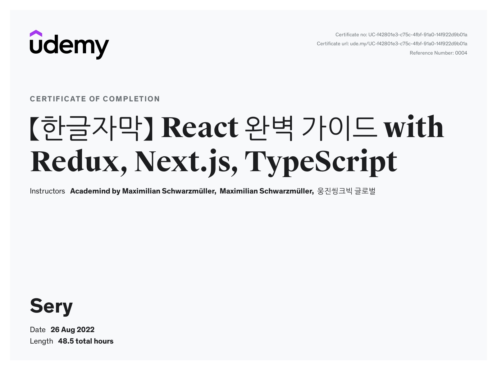

Udemy의 [React 완벽 가이드 with Redux, Next.js, TypeScript](https://www.udemy.com/course/best-react/) 강의를 듣고 공부한 내용입니다.

## 🖼 small projects demos in this course

#### [meetup-ish site with next.js 👀](https://meetup-yoonsery.vercel.app/)

#### react_meals

#### react_router

#### react_redux

#### react_http

#### from redux to hook

## Certification

